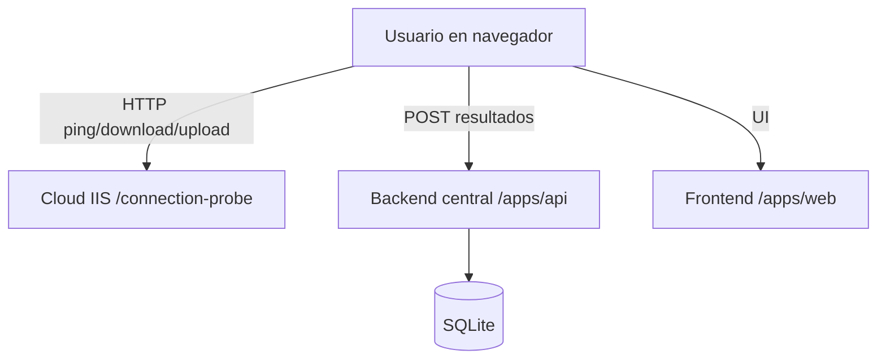

# Praxis Connection Test - Arquitectura

## Flujo técnico
- El usuario abre la web central y pega el URL del Cloud.
- El navegador ejecuta todas las mediciones contra `/connection-probe` del Cloud.
- El backend central solo recibe resultados ya medidos y los guarda en SQLite.
- El dashboard admin consulta el historial desde el backend.
